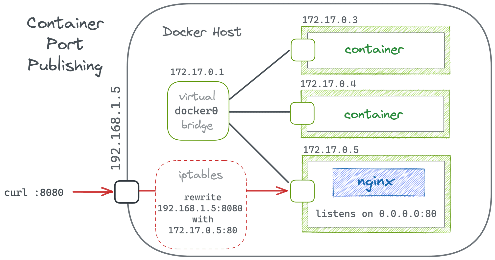

# Diving deeper

## Contents
[See image layers](#see-image-layers) </br>
[Searching Docker Hub](#searching-docker-hub) </br>
[Saving and Loading Docker images](#saving-and-loading-docker-images) </br>
[Image Tagging](#image-tagging) </br>
[Inspecting containers](#inspecting-containers) </br>
[Port mapping](#port-mapping) </br>
[Logs](#logs) </br>
[Execute commands in the container](#execute-commands-in-the-container) </br>
[Volumes](#volumes) </br>

## See image layers
- Docker images are built using a layered filesystem
- Each layer represents a set of filesystem changes, applied to the previous layer
- Each layer corresponds to a command in the `Dockerfile`
- To see the layers of an image:
    - each sha256 hash is a layer
```
$ docker inspect --format='{{.RootFS.Layers}}' <image-name>
[sha256:6a7f953ae30c9f480e6eaf7be8b1ba742bce57a3a83c43e927348e763cff7472 sha256:47eeda9418868d99763d3843150298589075da5317bfc98559882901d214e459 sha256:83eccd85c69cb031721e0594289575c7319168f0e0c822573729bbd572e69dc5 sha256:f2ddb60a28da2b86001d5c1a6418a661bf901bad06654ae71e3ae425977f1457 sha256:df20eaef6952795dc3899be991cdafc372ab4e4b51fadddb1f98d7a74f31cd0a sha256:b1484d87e77a0d9caade3eeeab4bfe50541c7b51e923b159a8f0cada206fa2b4 sha256:396214f7f8fc12fa1270ab1103263098b028017560b6be7bd0abb208c09536d9]
```
- Layers are cached to speed up builds of similar images
- Layers are shared between images to save disk space
- When pushing or pulling only the changed layers are transferred

## Searching Docker Hub
- You can search for images on the Docker Hub webiste
- Or you can search directly from your terminal using a command line tool:
    - This tool does not support searching for specific tags
```bash
$ docker search nginx
NAME                  DESCRIPTION                                     STARS   OFFICIAL AUTOMATED
nginx                 Official build of Nginx.                        15763   [OK]
jwilder/nginx-proxy   Automated Nginx reverse proxy for docker c...   2088             [OK]
...
```

## Saving and Loading Docker images
- You can save images as .tar files
    - For transferring between systems or for backup
- To save an image as a .tar into your current directory: 
```bash
docker save nginx > nginx.tar
```
- To load an image from a .tar file:
```bash
docker load < nginx.tar
```

## Image Tagging
- Tagging is like creating aliases for your Docker images
- Commonly used for organizing and versioning
```bash
$ docker tag <source_image_tag> <new_image_name>:<tag>
```
- Note the two images with the same Image ID:
```bash
$ docker tag nginx:latest my-nginx:v1
$ docker images
my-nginx       v1        058f4935d1cb   2 days ago       152MB
nginx          latest    058f4935d1cb   2 days ago       152MB
```

## Inspecting containers
- To get detailed information about a container in JSON format:
```bash
$ docker inspect nginx-detached
```
- This can be overwhelming
- Use the `-f` option to filter the output
```bash
$ docker inspect -f '{{range .NetworkSettings.Networks}}{{.IPAddress}}{{end}}' nginx-detached
```
```bash
$ docker inspect -f '{{.State.Status}}' nginx-detached
```
- You can get certain details with different commands
```bash
$ docker port nginx-detached
```

## Port mapping
- In general port mapping (or port forwarding) is an application of Network Address Translation (NAT). It redirects communication coming to a specific port on the router's public IP to a designated device and port on the private internal network.

- In Docker services inside a container are not reachable from the host by default
- Port mapping allows containers to communicate with the host system or external networks. It maps a port on the host system to a port inside the container. It creates a bridge between a host port and a container port

- By default there are no ports mapped on a container
- To create a container with port mapping:
```bash
$ docker run -p <host_port>:<container_port> <image>
```
- Try to create an `nginx` container with port mapping
    - Use the `-d` option to run the container in the background
```bash
$ docker run -d -p 8080:80 nginx
```
- What happens now:
    - Docker allocates a port on the host
    - Adds iptables (NAT) rules on the host
    - Forwards incoming traffic: traffic to host port -> container IP and port
    - Handles return traffic back to the client
- If you now try to connect to `http://localhost:8080`, it will be forwarded to the containers port 80
- You can map multiple ports at the same time:
```bash
$ docker -d -p 8080:80 -p 8443:443 nginx
```
- You can let Docker choose a random port on the host:
```bash
$ docker run -p 80 nginx
1a2b3c4d
$ docker port 1a2b3c4d
80/tcp -> 0.0.0.0:49153
```
- You can bind a specific host interface to a container port
    - Following example only allows connection from the localhost
    - Good for security
```bash
$ docker run -d -p 127.0.0.1:8080:80
```

## Logs
- To see the container logs:
    - You can reference a container by it's `CONTAINER ID` or it's `NAME`
```bash
$ docker logs nginx-detached
```
- This can be overwhelming. So to see only the end of the logs use the `--tail` option:
```bash
$ docker logs --tail 10 nginx-detached
```
- To follow the logs in real time use the `-f` or `--follow` option:
    - This streams new log entries as they come in
    - Exit the stream by pressing `Ctrl+C`
```bash
$ docker logs -f nginx-detached
```
- To show the timestamps of the logs as well, use the `-t` or `--timestamps` option
```bash
$ docker logs --timestamps nginx-detached
```

## Execute commands in the container
- You can execute command in a running container
- You can use it for debugging and maintenance
- Below commands are aliases
```bash
$ docker container exec <CONTAINER ID or NAME> <command> <arguments>
$ docker exec <CONTAINER ID or NAME> <command> <arguments>
```

## Volumes
- By default data inside a container lives only as long as container lives. If the container exits, crashes or stopped, the data inside is lost.
- Volumes are persistent data storages for containers, that are outside of the container, meaning they reside on host even after the container was stopped
- Volumes can be used for storing configuration files for containers
- Volumes are stored within a directory on the Docker host
- Volumes are managed by Docker, as opposed to [bind mounts](#bind-mounts)
- Volumes don't increase the size of the container
- To create a volume during container creation:
    - Below commands are equal, but `--mount` is preferred because it is most explicit and supports all the available options
```bash
$ docker run --mount type=volume,src=<volume-name>,dst=<mount-path>
$ docker run --volume <volume-name>:<mount-path>
```
```bash
$ docker run -d --name nginx-volume -p 8081:80 -v ~/home/myuser/nginx-data:/usr/share/nginx/html nginx
```
- `-d` run the container is detached mode
- `--name` name the container `nginx-volume`. If omitted, Docker generates a random name for the container
- `-v` mounts the `~/home/myuser/nginx-data` directory from the host to the `/usr/share/nginx/html` directory in the container
    - `/usr/share/nginx/html` is the directory where nginx looks for content to serve

### When to use volumes
- Use volumes to persist data generated and used by containers
- Volumes are easier to back up and migrate than [bind mounts](#bind-mounts)
- Volumes can be managed by Docker CLI and API
- Volumes work on any OS, Linuxx or Windows
- Volumes are safer to share among containers
- Volumes can pre-populated with content
- Volumes are faster to write to, that to the containers filesystem

## Bind mounts